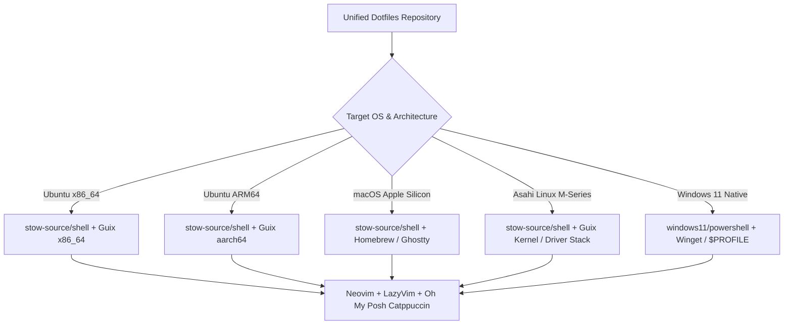

# Platform Feasibility & Agile Estimation Matrix

This matrix provides an Agile estimation and feasibility assessment for deploying a unified, reusable **Neovim (LazyVim)** + **Oh My Posh (Catppuccin)** + **Cascaydia Cove (Nerd Font)** development environment across 5 distinct target platform profiles.

---

## Assumptions for "Out-of-the-Box Fresh Machine"
1. Fresh default OS installation with administrative privileges (sudo / Administrator).
2. Internet access available for fetching binaries, fonts, and packages.
3. User terminal configured to support UTF-8 and 24-bit true color (xterm-256color / Ghostty / Windows Terminal).
4. Machine hardware baseline: Modern dual/quad-core CPU with at least 8 GB RAM.

---

## 1. Platform Feasibility Breakdown

| Target Platform | Feasibility Score | Agile Size / Story Points | Primary Package Manager | Key Technical Rationale & Safety Net |
|---|---|---|---|---|
| **1. Ubuntu x86_64 / AMD64 / Intel** | **9.5 / 10** | **3 SP (Small)** | **GNU Guix** (Primary) + apt | Proven in `ubuntu-len-yog-AMD64`. Minor handling for foreign distro SSL certs & locale paths. |
| **2. Ubuntu ARM64 (Snapdragon / Pi 4)** | **8.5 / 10** | **5 SP (Medium)** | **GNU Guix** (`aarch64-linux`) + apt | Native `aarch64` binary substitutes are available on `ci.guix.gnu.org`. C-compiler for Treesitter parsers needed. |
| **3. macOS (Apple Silicon M-Series)** | **9.0 / 10** | **5 SP (Medium)** | **Homebrew** (Safety Net) + Guix Darwin | **High Feasibility**: Proven prior setup. Homebrew acts as a unified package manager (like winget+choco+node+python in one). Guix Darwin runs seamlessly once installed, with extensive community guides available. |
| **4. Asahi Linux (M5 / Apple Silicon)** | **6.0 / 10** | **13 SP (X-Large)** | **GNU Guix** System / Userland | Cutting-edge M-series hardware support in upstream kernel. GPU acceleration for Ghostty/WezTerm; build dependencies for Neovim C plugins. |
| **5. Windows 11 Native (No WSL)** | **8.0 / 10** | **8 SP (Large)** | **Winget** + Chocolatey / PowerShell | Rewriting `.zshrc.d` to `$PROFILE` snippets (`Microsoft.PowerShell_profile.ps1`). Native symlinks via `New-Item -ItemType SymbolicLink`. |

---

## 2. Platform Nuances & Architecture Strategy

---

## 3. Agile Sprint Planning Recommendation

* **Sprint 1 (Velocity 8 SP)**: Complete Platform 1 (Ubuntu x86_64 - 3 SP) & Platform 2 (Ubuntu ARM64 - 5 SP) standardizations.
* **Sprint 2 (Velocity 13 SP)**: Complete Platform 3 (macOS + Homebrew + Ghostty - 5 SP) & Platform 5 (Windows 11 Native - 8 SP).
* **Sprint 3 (Velocity 13 SP)**: Complete Platform 4 (Asahi Linux on Apple Silicon M-series & Guix system definitions - 13 SP).
