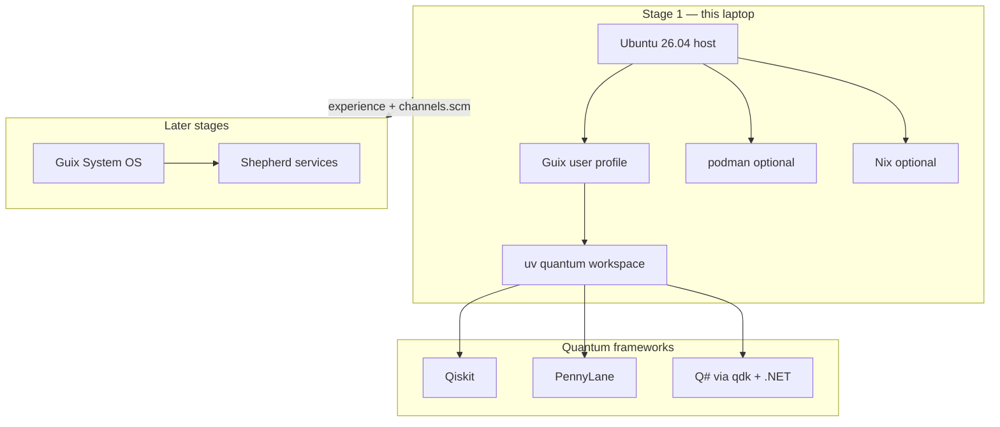
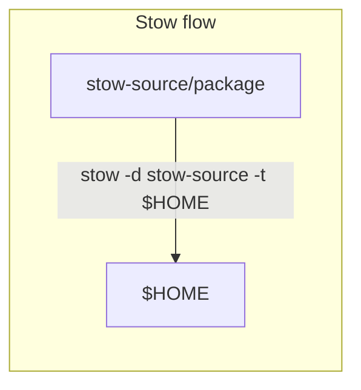

# ubuntu-len-yog-AMD64

Machine pack for the **Lenovo Yoga 7 2-in-1 14AHP9 (AMD64)** — Qimono infrastructure for the **Ying-Yang Project (2026/2027)**.

| Field | Value |
|-------|-------|
| Host | `qimono-localhost` |
| Hardware | Lenovo Yoga 7 2-in-1 14AHP9 (SKU 83DK) |
| CPU | AMD Ryzen 5 8640HS (6c/12t, Phoenix) |
| GPU | AMD Radeon 760M (HawkPoint1, iGPU) |
| Arch | `x86_64` / `amd64` |
| OS | Ubuntu 26.04 LTS (Resolute Raccoon) |
| Sibling | Lenovo Yoga Snapdragon → separate pack (not this tree) |
| Company | **Qimono** · program **Ying-Yang** |

This is **not** the archive under `dotfiles/ubuntu/` (old VPS/machines notes). This pack is the laptop AMD64 profile for stage‑1 Guix-on-Ubuntu.

Feedback tracking: [feedback-plan.md](./feedback-plan.md) · [tasks-priority-plan.md](./tasks-priority-plan.md)

---

## Package manager ranking (aspirational)

Not a hard law — a **wishable order** when availability and effort allow. Stage 1 of a longer path: day-to-day Guix profiles on Ubuntu → later **Guix as OS**, where apt/snap disappear and Podman/Nix still matter.

| Rank | Manager | Role when it wins |
|------|---------|-------------------|
| **1** | **GNU Guix** | Preferred userland: CLI, Python, editors, manifests, channels |
| **2** | **apt** | Host OS: kernel, firmware, desktop, system daemons |
| **3** | **snap** | Desktop apps when Guix effort is too high (migrate off when ready) |
| **4** | **podman** | Isolation, CI-like images, portable services |
| **5** | **Nix** | Escape hatch (e.g. difficult .NET); skill for Guix-as-OS era |

Details: [docs/package-managers.md](./docs/package-managers.md)

---

## Architecture (mermaid)

“Marketing” here means **making the backbone legible** — backend is invisible to screen-first teams unless we draw it.





---

## Layout

```
ubuntu-len-yog-AMD64/
  README.md
  MACHINE.md
  feedback-plan.md
  tasks-priority-plan.md
  docs/
    package-managers.md
    quantum-computing.md
    stow.md
    teach-inits-shepherd.md   # systemd vs Guix Shepherd
    teach-amd-v.md            # AMD-V / Hyper-V / emulators
    teach-portable-home.md    # $HOME on removable media
  guix/
    channels.scm
    manifests/
      base.scm
      quantum-host.scm
  scripts/
    bootstrap.sh
    install-guix-python-uv.sh
    install-quantum-python.sh
    install-qsharp.sh
    stow-apply.sh
  stow-source/                # NOT named "stow" (clearer CLI)
    shell/
    guix-env/
    quantum/
    # planned: emacs/ nvim/ vega/ …
  tests/
    smoke-tests/              # was tests/smoke-tests
    stubs/
```

---

## Quick start

```bash
cd ~/source/repos/qimono-repos/dotfiles/ubuntu-len-yog-AMD64
./scripts/bootstrap.sh

# stepwise
./scripts/install-guix-python-uv.sh
./scripts/stow-apply.sh
./scripts/install-quantum-python.sh
./scripts/install-qsharp.sh
```

Then open a new shell (or `source ~/.zshrc`) so Guix + `uv` are on `PATH`.

---

## Stow convention

Source tree is **`stow-source/`** (not `stow/`) so the command reads cleanly:

```bash
stow -d stow-source -t "$HOME" -v shell guix-env quantum
# or
./scripts/stow-apply.sh
```

Why we stow **snippets** (`.zshrc.d`) instead of a full `.zshrc`: [docs/stow.md](./docs/stow.md).

---

## Quantum frameworks (target)

| Framework | Language | Install path |
|-----------|----------|--------------|
| **Qiskit** | Python | uv project |
| **PennyLane** | Python | same uv env |
| **Q#** | Q# / .NET | host `dotnet` + Python `qdk` |
| **Jupyter** | — | local `jupyterlab` via uv (not Colab-only) |

Smoke tests: `tests/smoke-tests/` · full notes: [docs/quantum-computing.md](./docs/quantum-computing.md)

---

## Related locations and files

| Path | Meaning |
|------|---------|
| `dotfiles/ubuntu/` | **Archive / recopilation** of many VPS + old machines + one AMD mini PC — not “one VPS product” |
| `dotfiles/ubuntu/vps/` | Preferred VPS providers notes (Hostinger, AWS, Linode, Hetzner) |
| `dotfiles/ubuntu-mini-pc/` | Planned dedicated pack (same Ying-Yang project, stow rewritten with this pack’s lessons) |
| `dotfiles/gnu-guix/` | Shared Guix recipes, channels, install lists |
| `dotfiles/zsh/` | Shared zsh snippets (may diverge from live `~/.zshrc`) |
| `$HOME/AGENTS.md` | Agent-facing **machine** insights (not project-scoped) |
| `quantum-workspace/` | uv env for Qiskit / PennyLane / Q# |

---


## Guix browsers (Epiphany + Firefox) — first try

Lessons from production Yoga setup: **[docs/LESSONS-guix-browsers.md](./docs/LESSONS-guix-browsers.md)**

**Host AppArmor trap (do this first, survives reboot):**

```bash
./scripts/install-host-sysctl.sh
# → /etc/sysctl.d/99-guix-userns.conf
# without it: bwrap uid map Permission denied after every reboot
sysctl kernel.apparmor_restrict_unprivileged_userns   # must be 0
```

Also wired into `./scripts/bootstrap.sh` step 0.

```bash
./scripts/setup-guix-browser-prereqs.sh      # sudo: userns + nonguix key
./scripts/setup-guix-browsers-first-try.sh install
```

## Hardware pointer

Inventory and **AMD-V** teach-in: [MACHINE.md](./MACHINE.md) · [docs/teach-amd-v.md](./docs/teach-amd-v.md)
