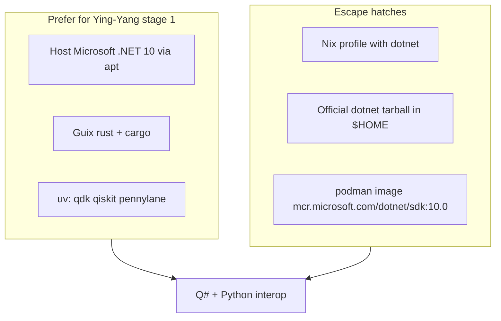

# Quantum host: .NET 10 + Rust under Guix-first policy

**Chunk:** P3.1 / P3.2 · Manifests: `guix/manifests/quantum-host*.scm`

## Problem

Q# / Azure Quantum ecosystem wants:

| Piece | On this Yoga today | Guix-native? |
|-------|--------------------|--------------|
| **.NET SDK 10** | Yes — `/usr/lib/dotnet` (Microsoft apt) | **No clean `dotnet` package** on current Guix channels searched |
| **Rust + cargo** | Not on PATH yet | **Yes** — `rust` + `rust:cargo` |
| **Python `qdk`** | uv workspace | PyPI via uv (correct) |

Feedback asked for creativity before declaring .NET on Guix impossible. Below are **layered strategies** that stay honest.



## Strategy A — Host .NET + Guix Rust (default on this laptop)

**Already true for .NET.** Document and keep:

```bash
dotnet --list-sdks   # expect 10.x
export DOTNET_ROOT=/usr/lib/dotnet
```

Install Rust from Guix (rank 1 for userland):

```bash
guix package -m guix/manifests/quantum-host-rust.scm
# or full intent:
# guix package -m guix/manifests/quantum-host.scm
source "$HOME/.guix-profile/etc/profile"
rustc --version
cargo --version
```

**Why this is not a failure of Guix-first:** apt remains correct for **host-integrated Microsoft packages** already present (same class as `code`). Guix owns the rest.

## Strategy B — Official .NET tarball (no apt, still not Guix store)

Useful on a pure-Guix-leaning user account or VPS without Microsoft repos:

```bash
# sketch — pin version from https://dotnet.microsoft.com/download
mkdir -p "$HOME/.local/share/dotnet"
# extract SDK tarball into that prefix
export DOTNET_ROOT="$HOME/.local/share/dotnet"
export PATH="$DOTNET_ROOT:$PATH"
```

Stow a shell snippet later under `stow-source/shell/.zshrc.d/30-dotnet-quantum.zsh` (already points at `/usr/lib/dotnet`; extend with fallback).

## Strategy C — Nix as package manager #5

Guix can install the **Nix** package manager itself:

```bash
guix install nix
# then follow Nix multi-user or single-user docs for your host
# nix profile install nixpkgs#dotnet-sdk_10   # name may vary by nixpkgs pin
```

Use when:

- You need a reproducible **dotnet** derivation Guix lacks.
- You are rehearsing life after apt/snap (Guix System later).

Do **not** install three copies of the same SDK (apt + tarball + nix) on 6.5 GiB RAM.

## Strategy D — Podman SDK image (rank 4)

```bash
podman run --rm -it \
  -v "$PWD":/work -w /work \
  mcr.microsoft.com/dotnet/sdk:10.0 \
  dotnet --info
```

Best for CI-parity and “dirty” experiments without touching the host profile.

## Strategy E — Research notes for true Guix .NET (future)

| Approach | Reality check |
|----------|----------------|
| Package `dotnet` from source on Guix | Huge, often broken, Microsoft’s build assumes their layout |
| Binary import via nonguix-style package | Possible community work; pin channel + hash; review license |
| `guix import` / fixed-output derivation of official tarball | Creative middle ground: Guix *manages* the tarball as a package |
| Wait for upstream Guix/nonguix improvements | Track `gnu/packages` and nonguix issues |

**Creative next experiment (next week):** write a Guix package that is a fixed-output derivation unpacking the official SDK into `/gnu/store/...-dotnet-sdk-10` and wrapping `dotnet`. That is Guix-managed without compiling Roslyn from source. Track under journal pending if not done this session.

## Rust role in this stack

- Native extensions, tooling around quantum projects, possible Azure/QIR adjacencies.
- Guix `rust` 1.85.x (channel snapshot) is enough for most tooling; pin in manifests when needed.

## What `quantum-host.scm` intentionally does *not* do

- Install Qiskit/PennyLane/qdk (use uv).
- Claim `dotnet` is a Guix package name that works today.
- Pull full `gcc-toolchain` + `gfortran` by default (see `quantum-host-native.scm`).

## Verify

```bash
dotnet --list-sdks
rustc --version || echo "run quantum-host-rust.scm"
cd "${QIMONO_QUANTUM_HOME:-$HOME/source/repos/qimono-repos/quantum-workspace}"
uv run python -c "from qdk import qsharp; print('qdk ok')"
```
