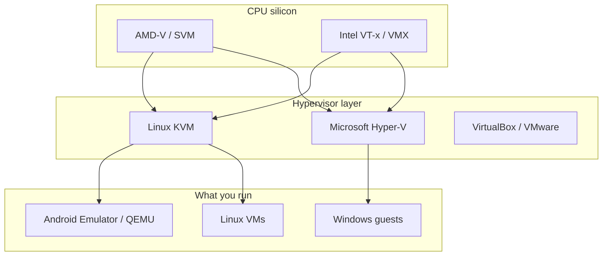

# Teach-in: AMD-V, Hyper-V, and mobile emulators (Ying-Yang)

Feedback question: *Is AMD-V the analog of Hyper-V? Can it help Android / non-conventional-screen emulation?*

## Short answers

| Question | Answer |
|----------|--------|
| Is AMD-V = Hyper-V? | **No.** AMD-V is a **CPU feature** (like Intel VT-x). Hyper-V is a **Microsoft hypervisor product** that *uses* those features. |
| Useful for Android Studio emulator? | **Yes, in principle** — KVM on Linux uses AMD-V; that is what makes hardware-accelerated VMs/emulators fast. |
| Automatic win on this Yoga? | Only if **KVM** is available to your user and the emulator is configured to use it. |

## Three layers people mix up



1. **CPU virtualization extensions**  
   - **AMD-V** (also called SVM) on this Ryzen 8640HS.  
   - **Intel VT-x** on Intel CPUs.  
   Same *job*: let a hypervisor run guests without pure software traps.

2. **Hypervisor**  
   - Linux: **KVM** (kernel module) + QEMU userspace.  
   - Windows: **Hyper-V**, sometimes WSL2’s Virtual Machine Platform.  
   - Type-2 tools (VirtualBox, etc.) also sit here.

3. **Workload**  
   Android Emulator, GNOME Boxes, nested CI VMs, etc.

So: **AMD-V ↔ VT-x** (peer features).  
**KVM ↔ Hyper-V** (peer hypervisors, different OS).  
Calling AMD-V “the Hyper-V of AMD” is the common confusion.

## What you did on Windows + Intel

Typical Android Studio path:

- Enable **VT-x** (and sometimes VT-d) in firmware.  
- Enable **Hyper-V** and/or **Windows Hypervisor Platform** / WHPX.  
- Emulator uses hardware acceleration instead of slow pure software.

On this **Ubuntu + AMD** laptop, the analogous path is:

- Confirm AMD-V is visible (`lscpu` → `Virtualization: AMD-V`).  
- Load **KVM**: packages like `qemu-kvm`, `libvirt`, user in `kvm` group.  
- Android Emulator / Android Studio → use **KVM** backend (not Hyper-V names).

## Commands to check (this machine)

```bash
# CPU advertises virtualization?
lscpu | grep -i virtualization
# flags often include svm (AMD) or vmx (Intel)
grep -E 'svm|vmx' /proc/cpuinfo | head -1

# KVM device nodes
ls -l /dev/kvm 2>/dev/null || echo "no /dev/kvm yet — install qemu-kvm / ensure module"

# Module
lsmod | grep kvm
```

If `/dev/kvm` is missing: install host packages (apt is correct here — kernel integration), add user to `kvm`/`libvirt`, reboot if needed.

## Ying-Yang 2026/2027 angle (mobile / non-conventional screens)

You already have **Vega / React Native / multi-TV** style work under `~/vega`. Hardware virtualization helps when:

| Workload | AMD-V / KVM helps? |
|----------|-------------------|
| Android Emulator (phone/TV form factors) | **Yes** — large FPS/start-time win |
| Nested Linux guests for CI-like UI tests | **Yes** |
| Physical phone via **KDE Connect** / USB debug | Different path (device, not hypervisor) |
| Snapdragon Yoga as *device* under test | Physical or cloud device lab — not this laptop’s AMD-V |
| iOS Simulator | **No** on Linux — needs macOS/Xcode |

**Recommendation for stage 1 infrastructure**

1. Keep **KVM ready** on this AMD Yoga for Android/TV emulators.  
2. Treat **phone as extension** (KDE Connect — separate task) for real-device loops.  
3. Do not expect AMD-V to replace cloud device farms or Apple silicon simulators.

## Firmware / dual-boot caveat

This disk dual-boots Windows. Sometimes Windows Hyper-V / Core Isolation leaves virtualization in a state that confuses Linux until firmware “SVM” stays enabled and Windows features are coordinated. If KVM fails after a Windows boot, check BIOS SVM and Windows virtualization-based security settings.

## One-line takeaway

**AMD-V is the CPU ticket; KVM is the Linux ride; Hyper-V is the Windows ride.** For Ying-Yang mobile/emulator work on this laptop, invest in **KVM + Android Emulator**, not in “turning on Hyper-V under Ubuntu.”
