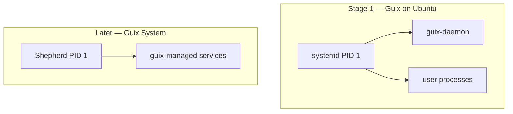

# Teach-in: systemd, Guix Shepherd, and “another daemon on Ubuntu”

Feedback: research the daemon manager used in Guix; clarify vs systemd; portable service config (ideally Lisp); optional second manager for e.g. podman auto-start.

## You were close — names clarified

| Name | What it actually is |
|------|---------------------|
| **GNU Hurd** | A **kernel** (alternative to Linux), not Guix’s default init |
| **Savannah** | GNU project **hosting** (git/web), not an init system |
| **GNU Shepherd** | Guix System’s **service / PID 1** manager (Scheme/Guile) |
| **systemd** | Default init on Ubuntu (and most modern distros) |

**Guix System** (full OS) uses **Shepherd**, configured in Guile Scheme inside `operating-system` / `services` forms — the “Lisp as configuration language” you want.

**Guix the package manager** on Ubuntu (this laptop, stage 1) does **not** replace systemd. Ubuntu remains systemd; Guix only manages user software in `/gnu/store` + profiles.



## systemd vs Shepherd (no 1:1 map)

| Concern | systemd | Shepherd |
|---------|---------|----------|
| Config language | unit files (ini-like) | Guile Scheme |
| Parallel start | strong | yes, dependency graph |
| Socket activation | native | different model |
| User services | `systemctl --user` | herd user services (Guix Home) |
| Portable to Ubuntu | native | **not** a drop-in second PID 1 |

You cannot “install Shepherd as systemd” without essentially becoming Guix System or running a nested VM. Two full init systems fighting PID 1 is a bad idea.

## What *is* portable?

1. **Container/unit of work** (Podman/Quadlet, docker-compose) — same service idea on Ubuntu and later Guix.  
2. **Declarative *description*** of services in Scheme (Guix) that *generates* or documents what to run — source of truth for Ying-Yang.  
3. **User-level** auto-start: systemd user units **today**; Guix Home services **later**.

### Practical stage‑1 pattern for “auto podman”

On Ubuntu, use **systemd user** (already there) — no second daemon required:

```ini
# ~/.config/systemd/user/podman-yingyang.service  (example sketch)
[Unit]
Description=Ying-Yang podman stack
After=network-online.target

[Service]
Type=oneshot
RemainAfterExit=yes
ExecStart=/usr/bin/podman start my-container
ExecStop=/usr/bin/podman stop my-container

[Install]
WantedBy=default.target
```

```bash
systemctl --user daemon-reload
systemctl --user enable --now podman-yingyang.service
```

Podman also has **Quadlet** (`.container` files under systemd generators) — good middle ground: declarative-ish, still systemd.

### Later Guix System sketch (Shepherd, Scheme)

```scheme
;; Illustrative only — real Guix service types differ by version
(service mystuff-service-type
  (mystuff-configuration
    (podman? #t)))
```

Channels + `config.scm` become the single source; experience you gain with **Podman** now transfers; apt/snap will not.

## Recommended Qimono path

| Stage | Init | Service style |
|-------|------|----------------|
| **1** (now) | systemd | user units / Quadlet for podman |
| **1b** | still systemd | document services as Scheme *comments* or small Guile that emits unit files |
| **2** Guix System | Shepherd | native Guix services |

## Takeaway

- Guix OS daemon manager ≈ **Shepherd** (Scheme), not Hurd/Savannah.  
- This Ubuntu machine keeps **systemd**; Guix coexists as packages + `guix-daemon`.  
- For “another daemon for podman,” prefer **systemd user + Podman/Quadlet**, and design Ying-Yang so the *intent* can later map to Shepherd.
