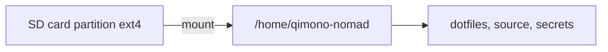

# Teach-in: `$HOME` as a mountable unit (SD / “qimono-nomad”)

Feedback: put `/home/qi` (or a nomad user) on removable media; unplug and move to Raspberry Pi, Snapdragon Yoga, Mac mini, etc.

## What Linux actually mounts

| Term | Meaning |
|------|---------|
| **Block device** | Disk, NVMe, USB stick, SD card (`/dev/mmcblk0`, `/dev/sdX`) |
| **Partition** | Slice of that device (`/dev/mmcblk0p1`) |
| **Filesystem** | Format on the partition (ext4, btrfs, xfs, …) |
| **Mount point** | Directory where it appears (`/home`, `/home/qimono-nomad`) |
| **`/home/qi` as unit** | Either whole `/home` on the card, or one user dir bind/mounted |

So yes: **`/home/qimono-nomad` can be a separate mount** — common pattern for portable “identity + projects.”



## Why this is attractive for Qimono

- Unplug **one** volume: configs, keys (careful!), repos, Guix profile *if stored there*.  
- Same Ying-Yang tree follows the human, not the chassis.  
- Aligns with multi-machine story (Yoga AMD, Yoga Snapdragon, mini PC, Pi).

## Why multi-arch teases hard problems

| Target | Arch | Risk when you insert the same card |
|--------|------|--------------------------------------|
| This Yoga | x86_64 | Baseline |
| HP ProBook Intel | x86_64 | Usually OK if same endian/FS and UIDs match |
| Snapdragon Yoga | **aarch64** | **Native binaries break** (Guix profile, `.venv`, `node_modules`, compiled wheels) |
| Raspberry Pi | **aarch64** (usually) | Same as Snapdragon |
| Mac mini | Darwin + arch | **Different OS** — Linux ext4 not native; needs VM/container/Linux kit |

**Filesystem** can be portable; **compiled userland inside `$HOME` is not.**

What *is* relatively portable:

- Source code, markdown, pure Python (recreate venv).  
- Stow *source* trees, channels.scm, manifests (rebuild profile on each arch).  
- SSH public keys; private keys only with encryption + threat model.

What is **not** portable across arch/OS:

- `~/.guix-profile` store links (paths are `/gnu/store/...-x86_64-...`).  
- `quantum-workspace/.venv` wheels.  
- Bun/Node native addons, VS Code server binaries, etc.

## Design options (decision aid)

### A. Whole `/home` on SD (aggressive)

- fstab: `/dev/disk/by-uuid/…  /home  ext4  defaults,nofail  0  2`  
- Pros: classic Unix.  
- Cons: laptop unusable without card; encryption + boot order pain; dual-boot messier.

### B. Single user mount (recommended experiment)

```text
/dev/disk/by-uuid/<UUID>  /home/qimono-nomad  ext4  defaults,nofail  0  2
```

- Create user `qimono-nomad` with **fixed UID/GID** (e.g. 2000) on every machine.  
- Keep `qi` local on internal NVMe for “always boots.”  
- Pros: safe experiments; remove card → only nomad disappears.

### C. Encrypted portable volume

- LUKS on SD; unlock after login.  
- Better if secrets live on the card.

### D. Sync instead of mount (compromise)

- Syncthing / git for selected trees.  
- No multi-arch binary illusion; less “literal SD OS.”

## Guix / Stow implications

1. Store **dotfiles repo** and **manifests** on the card — good.  
2. Run `guix package -m …` **per machine architecture** — do not copy `/gnu/store` between x86_64 and aarch64 casually.  
3. Stow apply on each host after mount.  
4. Prefer **uv projects** recreated with `uv sync` over copying `.venv`.

## Suggested experiment (when credit/risk allow — P4)

1. `sudo adduser --uid 2000 qimono-nomad`  
2. Format SD as ext4, label `QIMONO-NOMAD`.  
3. Mount to `/home/qimono-nomad`, `rsync` a **minimal** tree (dotfiles clone only).  
4. Log in as nomad; `guix install` / stow.  
5. Move card only to **same-arch** machine first (Intel x86_64).  
6. Later: aarch64 machine = rebuild, don’t clone store.

**Do not** start by relocating live `/home/qi` until the nomad user works.

## Decision recommendation (stage 1)

| Choice | Verdict |
|--------|---------|
| Separate mount for **nomad user** | **Yes — design for it** |
| Live `/home/qi` only on SD now | **No** — too easy to brick daily driver |
| Same card → Pi/Snapdragon without rebuild | **No** for binaries; **yes** for sources + manifests |
| Mac mini | Treat as **remote** or Linux VM consumer of the same git, not raw ext4 home |

## One-line takeaway

Make **`$HOME` content portable as data + declarations**; make **profiles and venvs local rebuilds**. The SD card is a **carrier for the Ying-Yang identity**, not a universal binary blob across AMD64/ARM64/macOS.
